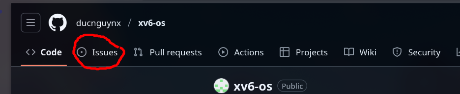
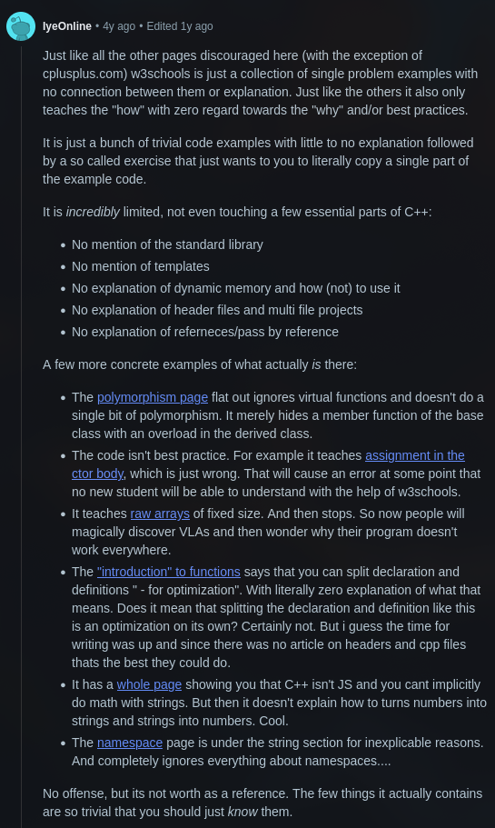

# 2slabWiki - Một số tài liệu hữu ích cho dự án đầu vào

Như các bạn đã biết, dự án đầu vào gồm nhiều phần liên quan tới nhiều mảng kiến thức khác nhau. Repository này tổng hợp các kiến thức về mạng máy tính, lập trình nhúng cho đến phát triển phần mềm và quản trị cơ sở dữ liệu.

## LƯU Ý

Vì số lượng thành viên khá đông (11 người), sẽ có trường hợp một câu hỏi được hỏi nhiều lần. Vì vậy, để tiện cho các nhóm theo dõi, khi có câu hỏi, các bạn cần tạo 1 Github Issue ở repository này.

Các bạn có thể đóng góp các ý tưởng hay vào github repository này (fork + pull request)

Câu trả lời sẽ được public trực tiếp ở phần [FAQs](#frequently-asked-questions)

##  Mục Lục

- [Thiết Kế Mạch với Altium Designer](#thiết-kế-mạch-với-altium-designer)
- [Nguyên Lý Mạng Máy Tính](#nguyên-lý-mạng-máy-tính)
- [Lập Trình ESP32 với IDF](#lập-trình-esp32-với-idf)
- [Ngôn Ngữ Lập Trình](#ngôn-ngữ-lập-trình)
  - [Ngôn Ngữ C](#ngôn-ngữ-c)
  - [JavaScript](#javascript)
  - [Node.js](#nodejs)
- [Cơ Sở Dữ Liệu SQL](#cơ-sở-dữ-liệu-sql)

---

## Thiết Kế Mạch với Altium Designer

Altium Designer là một trong những phần mềm thiết kế mạch điện tử (PCB) mạnh mẽ và phổ biến nhất hiện nay. Mặc dù có nhiều phần mềm khác như Kicad hoặc Autodesk Fusion nhưng để nhận được sự hỗ trợ từ nhóm hướng dẫn, các bạn nên dùng Altium

> Các bạn KHÔNG cần crack Altium. Sinh viên được sử dụng Altium & Altium 365 miễn phí. Tham khảo thêm ở [đây](https://www.altium.com/education/students)

Cách tốt nhất để học Altium là thực hành vẽ một mạch cơ bản từ A đến Z. Từ đó, các bạn sẽ biết sử dụng phần mềm một cách chuẩn nhất.

- **[Altium Designer Tutorial for Beginners](https://www.youtube.com/watch?v=PqFtSpAXB9Q)**: Video hướng dẫn cơ bản về Altium
- **[ How to Make Custom ESP32 Board in Altium Designer | Full Tutorial ](https://www.youtube.com/watch?v=KWIzhbQaZZk)**: Thiết kế một Kit ESP32 từ đầu
- **[Phil's Lab](https://www.youtube.com/@PhilsLab/featured)**: Một kênh Youtube hướng dẫn vẽ mạch sử dụng nhiều phần mềm, song song với kênh của [Robert Feranec](https://www.youtube.com/@RobertFeranec). Các bạn thích phong cách diễn giải của ai thì có thể xem của người đấy.

> LƯU Ý: Có một số tutorial trên Youtube khác hướng dẫn vẽ mạch khá linh tinh (từ import thư viện, tổ chức file, ...). Các bạn nên tham khảo các video ở trên

Altium chỉ là công cụ để vẽ một mạch in (PCB), tức là các bạn phải có hiểu biết về cách đấu nối các thiết bị trên breadboard và test hoạt động ổn định trước khi dùng Alitum để vẽ mạch in PCB

---

## Lập Trình ESP32 với IDF

Có 2 framework chính để lập trình ESP32 (Arduino Framework và ESP-IDF). Các bạn muốn tùy biến & hiểu sâu về lập trình ESP32 có thể sử dụng ESP-IDF

- **[Tài liệu lập trình ESP-IDF (Official)](https://docs.espressif.com/projects/esp-idf/en/latest/esp32/get-started/index.html)**: Tài liệu chính thức, các bạn nên tham khảo các API sử dụng ở tài liệu này.
- **[ESP32-IDF Video Tutorial](https://youtube.com/playlist?list=PLfIJKC1ud8ghS_i2Yky2actXWbQoqrscN&si=JIX3D56zUv7HC8tC)**: Với dự án đầu vào, các bạn có thể tham khảo thẳng các video ở đây để thực hiện một cách dễ dàng hơn.

## Nguyên Lý Mạng Máy Tính

Trong dự án đầu vào, các bạn sẽ thực hiện việc chuyển dữ liệu từ cảm biến tới ESP rồi sau đó tới server chạy trên máy tính. Vì vậy kiến thức về mạng máy tính là rất cần thiết. Phần này để hiểu chi tiết từng chút một thì khá là phức tạp, các bạn mới bắt đầu nên theo công thức: giải thích khái niệm B bằng A (A mặc định là chân lý, dù mình chưa hiểu tại sao). Và dần dần tìm hiểu các khái niệm sâu hơn.

> VÍ DỤ: Để nhiều thiết bị có thể giao tiếp với nhau, ta cần dùng Switch vì Switch có khả năng chuyển tiếp gói tin dựa vào địa chỉ MAC. (Rồi mình sẽ tìm hiểu sau là tại sao Switch lại làm được như vậy)

- **[Computer Networking: A Top-Down Approach](https://www.youtube.com/playlist?list=PLm556dMNleHc1MWN5BX9B2XkwkNE2Djiu)**: Tập hợp các bài giảng từ A đến Z (cơ bản) về mạng máy tính.
- **[Computer Networking: A Top-Down Approach (Sách)](https://networking.harshkapadia.me/files/books/computer-networking-a-top-down-approach-8th-edition.pdf)**: Với ai không thích xem video Youtube
- **[Networking concepts for developers (MDN)](https://developer.mozilla.org/en-US/docs/Web/HTTP/Basics_of_HTTP)**: Các khái niệm mạng thường dùng trong lập trình web

Các khái niệm các bạn cần biết

1. Các mô hình mạng

2. Truyền tin giữa các thiết bị trong mạng, dạng dữ liệu

3. Các thành phần trong một mạng

4. Mô hình 7 lớp (OSI) và 4 lớp

5. Chức năng của từng lớp trong mạng

6. IPv4 và IPv6

7. TCP và UDP

8. Client, Server, Router, DNS, ...

9. HTTP và MQTT.

---

## Ngôn Ngữ Lập Trình

Nếu muốn học nhanh một ngôn ngữ, các bạn có thể tham khảo [trang web này](https://learnxinyminutes.com/). Bây giờ LLMs (ChatGPT, Gemini, Claude,...) đã làm quá tốt trong việc viết code (các mô hình private có thể giải được tất cả các bài test lập trình về thuật toán, kể cả những bài trong ICPC). Nhưng các bạn vẫn cần hiểu 100% code các bạn viết.

> LƯU Ý: Nhóm hướng dẫn sẽ giúp các bạn debug code. Tuy nhiên, nếu các bạn chỉ thuần copy paste từ LLMs, không hiểu code và đưa code cho nhóm hướng dẫn debug -> 99% loại

Với dự án đầu vào, mình nghĩ phần lập trình cũng khá đơn giản..

### C

C là ngôn ngữ lập trình được sử dụng nhiều nhất trong lập trình nhúng & hệ điều hành (cùng với Assembly), nó giúp các bạn hiểu sâu về cách máy tính hoạt động. Đây là ngôn ngữ bắt buộc phải biết trong lập trình nhúng và hệ thống.

Tuy nhiên, thời gian đầu, các bạn phần lớn chỉ dùng thư viện và hiểu cách gọi hàm, nên kiến thức cần biết cũng khá đơn giản. Ai đã qua môn kĩ thuật lập trình thì cũng không cần lo lắng nhiều.

- **[The C Programming Language (Sách của K&R)](https://seriouscomputerist.atariverse.com/media/pdf/book/C%20Programming%20Language%20-%202nd%20Edition%20(OCR).pdf)**: Sách dạy lập trình C với các ví dụ cũng như cách dẫn dắt chi tiết.

### C++
Các bạn có thể không cần sử dụng C++ ở dự án này, nhưng nếu có  (dùng Arduino framework / hoặc viết Web server dùng thư viện Crow), các bạn nên tham khảo [Learn CPP](https://www.learncpp.com/) vì nó đơn giản luôn cập nhật tính năng ở các bản C++ mới nhất, đọc dễ hiểu. Và lý do thứ 2

### JavaScript [Sơn vào chỉnh]

JavaScript là ngôn ngữ của web. Từ một ngôn ngữ chỉ chạy trên trình duyệt, JS nay đã có thể làm được mọi thứ từ backend, mobile app đến machine learning.

- **[JavaScript.info](https://javascript.info/)**: Hướng dẫn cực kỳ chi tiết và hiện đại, từ cơ bản đến nâng cao.
- **[MDN Web Docs (JavaScript)](https://developer.mozilla.org/en-US/docs/Web/JavaScript)**: Tài liệu tham khảo chuẩn xác nhất từ Mozilla.
- **[FreeCodeCamp - JavaScript Algorithms and Data Structures](https://www.freecodecamp.org/learn/javascript-algorithms-and-data-structures/)**: Học qua các dự án và thử thách thực tế.

### Node.js [Sơn vào chỉnh]

Node.js là môi trường chạy JavaScript phía server, giúp xây dựng các ứng dụng web tốc độ cao và có khả năng mở rộng tốt.

- **[Node.js Official Documentation](https://nodejs.org/en/docs/)**: Tài liệu chính thức.
- **[The Node.js Handbook (FreeCodeCamp)](https://www.freecodecamp.org/news/the-definitive-node-js-handbook-6912378afc6e/)**: Hướng dẫn toàn diện cho người mới bắt đầu.
- **[Express.js](https://expressjs.com/)**: Framework phổ biến nhất để xây dựng web API với PostgreNode.js.

---

## Cơ Sở Dữ Liệu SQL [Sơn bổ sung]

Dự sẽ bao gồm một cơ sở dữ liệu, các bạn sẽ sử dụng cơ sở dữ liệu SQL để lưu trữ các dữ liệu đo từ cảm biến

- **[SQL Tutorial](https://neon.com/postgresql/tutorial)**: Học các khái niệm của PostgreSQL qua các bài tập

Chúc bạn học tập hiệu quả!

## Frequently Asked Questions
